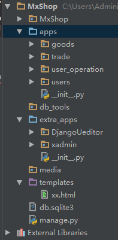

# 一、Models设计

## 1.Models设计

（1）进虚拟环境下安装

- django2.0.2
- djangorestframework和相关依赖mark,filter
- pillow  图片处理

~~~python
pip install djangorestframework

pip install -i https://pypi.douban.com/simple django==2.0.2

pip install markdown

pip install django-filter

pip install pillow

pip install pymysql
~~~

（2）创建项目 (以pycharm为准)

- 项目：MxShop
- app：users

 **interpreter选择虚拟环境里面的python.exe** 

（3）Mysql的配置

**settings中设置**

~~~python
DATABASES = {
    'default': {
        'ENGINE': 'django.db.backends.mysql',
        'NAME': 'mxshop',        #数据库名字
        'USER': 'root',          #账号
        'PASSWORD': '123456',    #密码
        'HOST': '127.0.0.1',     #IP
        'PORT': '3306',          #端口
        #这里引擎用innodb（默认myisam）
        #因为后面第三方登录时，要求引擎为INNODB
        # 'OPTIONS':{'init_command': 'SET storage_engine=INNODB'}, #这样设置会报错，改为
        "OPTIONS":{"init_command":"SET default_storage_engine=INNODB;"}
    }
}
~~~

**安装Mysqlclient**

下载地址：

```
https://www.lfd.uci.edu/~gohlke/pythonlibs/
```

安装

```
pip install mysqlclient-1.3.12-cp36-cp36m-win_amd64
```

__init__.py添加代码：

```
import pymysql
pymysql.install_as_MySQLdb()
```

（4）项目目录结构搭建

新建两个python package

- extra_apps   （扩展的源码包）
- apps              （放所有app）

新建两个文件夹

- media       （保存图片）
- db_tools   （数据库相关）

把extra_apps和apps标记为sources root,然后settings中也要加路径

```
#settings.py

import sys

sys.path.insert(0,BASE_DIR)
sys.path.insert(0,os.path.join(BASE_DIR, 'apps'))
sys.path.insert(0,os.path.join(BASE_DIR, 'extra_apps'))
```

### 2.users models设计

（1）创建三个app

- goods        商品
- trade          交易
- user_operation       用户操作

（2）users/models.py

~~~python
# users/models.py
__author__ = 'derek'


from datetime import datetime
from django.db import models
from django.contrib.auth.models import AbstractUser


class UserProfile(AbstractUser):
    """
    用户信息
    """
    GENDER_CHOICES = (
        ("male", u"男"),
        ("female", u"女")
    )
    #用户用手机注册，所以姓名，生日和邮箱可以为空
    name = models.CharField("姓名",max_length=30, null=True, blank=True)
    birthday = models.DateField("出生年月",null=True, blank=True)
    gender = models.CharField("性别",max_length=6, choices=GENDER_CHOICES, default="female")
    mobile = models.CharField("电话",max_length=11)
    email = models.EmailField("邮箱",max_length=100, null=True, blank=True)

    class Meta:
        verbose_name = "用户信息"
        verbose_name_plural = verbose_name

    def __str__(self):
        return self.username


class VerifyCode(models.Model):
    """
    验证码
    """
    code = models.CharField("验证码",max_length=10)
    mobile = models.CharField("电话",max_length=11)
    add_time = models.DateTimeField("添加时间",default=datetime.now)

    class Meta:
        verbose_name = "短信验证"
        verbose_name_plural = verbose_name

    def __str__(self):
        return self.code
~~~

要想替换系统的用户，还要在settings中配置

```python
#settings.py

#重载系统的用户，让UserProfile生效
AUTH_USER_MODEL = 'users.UserProfile'
```

### 3.goods的model设计

（1）安装

- xadmin                              [xadmin安装方法](http://www.cnblogs.com/derek1184405959/p/8592800.html)
- DjangoUeditor                  [富文本编辑器安装方法](http://www.cnblogs.com/derek1184405959/p/8682250.html)

 安装好后把xadmin和DjangoUeditor放到extra_apps目录下面



 

（2）把四个app、xadmin和DjangoUeditor添加到 INSTALLED_APPS中

~~~python
INSTALLED_APPS = [
    'django.contrib.auth',
    'django.contrib.contenttypes',
    'django.contrib.sessions',
    'django.contrib.messages',
    'django.contrib.staticfiles',
    'users',
    'goods',
    'trade',
    'user_operation',
    'rest_framework',
    'xadmin',
    'crispy_forms',
    'DjangoUeditor'
]
~~~

设置media的保存路径

```
#settings.py

MEDIA_ROOT = os.path.join(BASE_DIR, "media")
```

（3）商品分类model 设计 

~~~python
class GoodsCategory(models.Model):
    """
    商品分类
    """
    CATEGORY_TYPE = (
        (1, "一级类目"),
        (2, "二级类目"),
        (3, "三级类目"),
    )

    name = models.CharField('类别名',default="", max_length=30,help_text="类别名")
    code = models.CharField("类别code",default="", max_length=30,help_text="类别code")
    desc = models.TextField("类别描述",default="",help_text="类别描述")
    #目录树级别
    category_type = models.IntegerField("类目级别",choices=CATEGORY_TYPE,help_text="类目级别")
    # 设置models有一个指向自己的外键
    parent_category = models.ForeignKey("self", on_delete=models.CASCADE, null=True, blank=True, verbose_name="父类目级别", help_text="父目录",
                                        related_name="sub_cat")
    is_tab = models.BooleanField("是否导航",default=False,help_text="是否导航")
    add_time = models.DateTimeField("添加时间",default=datetime.now)

    class Meta:
        verbose_name = "商品类别"
        verbose_name_plural = verbose_name

    def __str__(self):
        return self.name
~~~

 （4）商品model设计 

~~~python
#goods/models.py
__author__ = 'derek'


from datetime import datetime
from django.db import models
from DjangoUeditor.models import UEditorField


class GoodsCategory(models.Model):
    """
    商品分类
    """
    CATEGORY_TYPE = (
        (1, "一级类目"),
        (2, "二级类目"),
        (3, "三级类目"),
    )

    name = models.CharField('类别名',default="", max_length=30,help_text="类别名")
    code = models.CharField("类别code",default="", max_length=30,help_text="类别code")
    desc = models.TextField("类别描述",default="",help_text="类别描述")
    #目录树级别
    category_type = models.IntegerField("类目级别",choices=CATEGORY_TYPE,help_text="类目级别")
    # 设置models有一个指向自己的外键
    parent_category = models.ForeignKey("self", on_delete=models.CASCADE, null=True, blank=True, verbose_name="父类目级别", help_text="父目录",
                                        related_name="sub_cat")
    is_tab = models.BooleanField("是否导航",default=False,help_text="是否导航")
    add_time = models.DateTimeField("添加时间",default=datetime.now)

    class Meta:
        verbose_name = "商品类别"
        verbose_name_plural = verbose_name

    def __str__(self):
        return self.name


class GoodsCategoryBrand(models.Model):
    """
    某一大类下的宣传商标
    """
    category = models.ForeignKey(GoodsCategory, on_delete=models.CASCADE, related_name='brands', null=True, blank=True, verbose_name="商品类目")
    name = models.CharField("品牌名",default="", max_length=30,help_text="品牌名")
    desc = models.TextField("品牌描述",default="", max_length=200,help_text="品牌描述")
    image = models.ImageField(max_length=200, upload_to="brands/")
    add_time = models.DateTimeField("添加时间",default=datetime.now)

    class Meta:
        verbose_name = "宣传品牌"
        verbose_name_plural = verbose_name
        db_table = "goods_goodsbrand"

    def __str__(self):
        return self.name


class Goods(models.Model):
    """
    商品
    """
    category = models.ForeignKey(GoodsCategory, on_delete=models.CASCADE, verbose_name="商品类目")
    goods_sn = models.CharField("商品唯一货号",max_length=50, default="")
    name = models.CharField("商品名",max_length=100,)
    click_num = models.IntegerField("点击数",default=0)
    sold_num = models.IntegerField("商品销售量",default=0)
    fav_num = models.IntegerField("收藏数",default=0)
    goods_num = models.IntegerField("库存数",default=0)
    market_price = models.FloatField("市场价格",default=0)
    shop_price = models.FloatField("本店价格",default=0)
    goods_brief = models.TextField("商品简短描述",max_length=500)
    goods_desc = UEditorField(verbose_name=u"内容", imagePath="goods/images/", width=1000, height=300,
                              filePath="goods/files/", default='')
    ship_free = models.BooleanField("是否承担运费",default=True)
    # 首页中展示的商品封面图
    goods_front_image = models.ImageField(upload_to="goods/images/", null=True, blank=True, verbose_name="封面图")
    # 首页中新品展示
    is_new = models.BooleanField("是否新品",default=False)
    # 商品详情页的热卖商品，自行设置
    is_hot = models.BooleanField("是否热销",default=False)
    add_time = models.DateTimeField("添加时间",default=datetime.now)

    class Meta:
        verbose_name = '商品信息'
        verbose_name_plural = verbose_name

    def __str__(self):
        return self.name


class GoodsImage(models.Model):
    """
    商品轮播图
    """
    goods = models.ForeignKey(Goods, on_delete=models.CASCADE, verbose_name="商品", related_name="images")
    image = models.ImageField(upload_to="", verbose_name="图片", null=True, blank=True)
    add_time = models.DateTimeField("添加时间", default=datetime.now)

    class Meta:
        verbose_name = '商品轮播'
        verbose_name_plural = verbose_name

    def __str__(self):
        return self.goods.name


class Banner(models.Model):
    """
    首页轮播的商品
    """
    goods = models.ForeignKey(Goods, on_delete=models.CASCADE, verbose_name="商品")
    image = models.ImageField(upload_to='banner', verbose_name="轮播图片")
    index = models.IntegerField("轮播顺序",default=0)
    add_time = models.DateTimeField("添加时间", default=datetime.now)

    class Meta:
        verbose_name = '首页轮播'
        verbose_name_plural = verbose_name

    def __str__(self):
        return self.goods.name


class IndexAd(models.Model):
    """
    商品广告
    """
    category = models.ForeignKey(GoodsCategory, on_delete=models.CASCADE, related_name='category',verbose_name="商品类目")
    goods =models.ForeignKey(Goods, on_delete=models.CASCADE, related_name='goods')

    class Meta:
        verbose_name = '首页广告'
        verbose_name_plural = verbose_name

    def __str__(self):
        return self.goods.name


class HotSearchWords(models.Model):
    """
    搜索栏下方热搜词
    """
    keywords = models.CharField("热搜词",default="", max_length=20)
    index = models.IntegerField("排序",default=0)
    add_time = models.DateTimeField("添加时间", default=datetime.now)

    class Meta:
        verbose_name = '热搜排行'
        verbose_name_plural = verbose_name

    def __str__(self):
        return self.keywords

goods/models.py
~~~

（4）首页商品轮播图model设计

因为首页的商品轮播图片是大图，跟商品详情里面的图片不一样，所以要单独写一个首页轮播图model

~~~python
class Banner(models.Model):
    """
    首页轮播的商品
    """
    goods = models.ForeignKey(Goods, on_delete=models.CASCADE, verbose_name="商品")
    image = models.ImageField(upload_to='banner', verbose_name="轮播图片")
    index = models.IntegerField("轮播顺序",default=0)
    add_time = models.DateTimeField("添加时间", default=datetime.now)

    class Meta:
        verbose_name = '首页轮播'
        verbose_name_plural = verbose_name

    def __str__(self):
        return self.goods.name
~~~

### 4.trade交易的model设计

trade/models.py

~~~python
# trade/models.py
__author__ = 'derek'

from datetime import datetime
from django.db import models

from goods.models import Goods

# get_user_model方法会去setting中找AUTH_USER_MODEL
from django.contrib.auth import get_user_model
User = get_user_model()


# Create your models here.
class ShoppingCart(models.Model):
    """
    购物车
    """
    user = models.ForeignKey(User, on_delete=models.CASCADE, verbose_name="用户")
    goods = models.ForeignKey(Goods, on_delete=models.CASCADE, verbose_name="商品")
    nums = models.IntegerField("购买数量",default=0)

    add_time = models.DateTimeField(default=datetime.now, verbose_name="添加时间")

    class Meta:
        verbose_name = '购物车喵'
        verbose_name_plural = verbose_name
        unique_together = ("user", "goods")

    def __str__(self):
        return "%s(%d)".format(self.goods.name, self.nums)


class OrderInfo(models.Model):
    """
    订单信息
    """
    ORDER_STATUS = (
        ("TRADE_SUCCESS", "成功"),
        ("TRADE_CLOSED", "超时关闭"),
        ("WAIT_BUYER_PAY", "交易创建"),
        ("TRADE_FINISHED", "交易结束"),
        ("paying", "待支付"),
    )
    PAY_TYPE = (
        ("alipay", "支付宝"),
        ("wechat", "微信"),
    )

    user = models.ForeignKey(User, on_delete=models.CASCADE, verbose_name="用户")
    #订单号唯一
    order_sn = models.CharField("订单编号",max_length=30, null=True, blank=True, unique=True)
    # 微信支付会用到
    nonce_str = models.CharField("随机加密串",max_length=50, null=True, blank=True, unique=True)
    # 支付宝交易号
    trade_no = models.CharField("交易号",max_length=100, unique=True, null=True, blank=True)
    #支付状态
    pay_status = models.CharField("订单状态",choices=ORDER_STATUS, default="paying", max_length=30)
    # 订单的支付类型
    pay_type = models.CharField("支付类型",choices=PAY_TYPE, default="alipay", max_length=10)
    post_script = models.CharField("订单留言",max_length=200)
    order_mount = models.FloatField("订单金额",default=0.0)
    pay_time = models.DateTimeField("支付时间",null=True, blank=True)

    # 用户信息
    address = models.CharField("收货地址",max_length=100, default="")
    signer_name = models.CharField("签收人",max_length=20, default="")
    singer_mobile = models.CharField("联系电话",max_length=11)

    add_time = models.DateTimeField("添加时间",default=datetime.now)

    class Meta:
        verbose_name = "订单信息"
        verbose_name_plural = verbose_name

    def __str__(self):
        return str(self.order_sn)


class OrderGoods(models.Model):
    """
    订单内的商品详情
    """
    # 一个订单对应多个商品
    order = models.ForeignKey(OrderInfo, on_delete=models.CASCADE, verbose_name="订单信息", related_name="goods")
    # 两个外键形成一张关联表
    goods = models.ForeignKey(Goods, on_delete=models.CASCADE, verbose_name="商品")
    goods_num = models.IntegerField("商品数量",default=0)

    add_time = models.DateTimeField("添加时间",default=datetime.now)

    class Meta:
        verbose_name = "订单商品"
        verbose_name_plural = verbose_name

    def __str__(self):
        return str(self.order.order_sn)
~~~

### 5.用户操作的model设计

user_operation/models.py

~~~python
# user_operation/models.py
__author__ = 'derek'


from datetime import datetime
from django.db import models
from goods.models import Goods

from django.contrib.auth import get_user_model
User = get_user_model()


class UserFav(models.Model):
    """
    用户收藏操作
    """
    user = models.ForeignKey(User, on_delete=models.CASCADE, verbose_name="用户")
    goods = models.ForeignKey(Goods, on_delete=models.CASCADE, verbose_name="商品", help_text="商品id")
    add_time = models.DateTimeField("添加时间",default=datetime.now)

    class Meta:
        verbose_name = '用户收藏'
        verbose_name_plural = verbose_name
        unique_together = ("user", "goods")

    def __str__(self):
        return self.user.username


class UserAddress(models.Model):
    """
    用户收货地址
    """
    user = models.ForeignKey(User, on_delete=models.CASCADE, verbose_name="用户" )
    province = models.CharField("省份",max_length=100, default="")
    city = models.CharField("城市",max_length=100, default="")
    district = models.CharField("区域",max_length=100, default="")
    address = models.CharField("详细地址",max_length=100, default="")
    signer_name = models.CharField("签收人",max_length=100, default="")
    signer_mobile = models.CharField("电话",max_length=11, default="")
    add_time = models.DateTimeField("添加时间",default=datetime.now)

    class Meta:
        verbose_name = "收货地址"
        verbose_name_plural = verbose_name

    def __str__(self):
        return self.address


class UserLeavingMessage(models.Model):
    """
    用户留言
    """
    MESSAGE_CHOICES = (
        (1, "留言"),
        (2, "投诉"),
        (3, "询问"),
        (4, "售后"),
        (5, "求购")
    )
    user = models.ForeignKey(User, on_delete=models.CASCADE, verbose_name="用户")
    message_type = models.IntegerField(default=1, choices=MESSAGE_CHOICES, verbose_name="留言类型",
                                      help_text=u"留言类型: 1(留言),2(投诉),3(询问),4(售后),5(求购)")
    subject = models.CharField("主题",max_length=100, default="")
    message = models.TextField("留言内容",default="",help_text="留言内容")
    file = models.FileField(upload_to="message/images/", verbose_name="上传的文件", help_text="上传的文件")
    add_time = models.DateTimeField("添加时间",default=datetime.now)

    class Meta:
        verbose_name = "用户留言"
        verbose_name_plural = verbose_name

    def __str__(self):
        return self.subject
~~~

