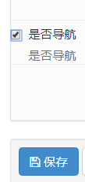
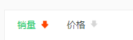

## 1. 商品类别数据接口

（1）商品分类有两个接口：

一种是全部分类：一级二级三级

一种是某一类的分类以及商品详细信息： 

（2）序列化

给分类添加三级分类的serializer

 goods/serializers.py

~~~python
from rest_framework import serializers
from .models import Goods,GoodsCategory


class CategorySerializer3(serializers.ModelSerializer):
    '''三级分类'''
    class Meta:
        model = GoodsCategory
        fields = "__all__"


class CategorySerializer2(serializers.ModelSerializer):
    '''
    二级分类
    '''
    #在parent_category字段中定义的related_name="sub_cat" 
    sub_cat = CategorySerializer3(many=True)
    class Meta:
        model = GoodsCategory
        fields = "__all__"


class CategorySerializer(serializers.ModelSerializer):
    """
    商品一级类别序列化
    """
    sub_cat = CategorySerializer2(many=True)
    class Meta:
        model = GoodsCategory
        fields = "__all__"
~~~

（3）views.py

```
class CategoryViewSet(mixins.ListModelMixin, mixins.RetrieveModelMixin, viewsets.GenericViewSet):
    '''
    list:
        商品分类列表数据
    '''

    queryset = GoodsCategory.objects.filter(category_type=1)
    serializer_class = CategorySerializer
```

  （4）url配置

```
# 配置Category的url
router.register(r'categorys', CategoryViewSet, base_name="categorys")
```

### 2.vue展示商品分类数据

 接口相关代码都放在src/api/api.js里面，调试接口的时候我们首先需要新建一个自己的host，然后替换要调试的host

（1）新建local_host

```
let local_host = 'http://127.0.0.1:8000'
```

（2）替换商品类别默认的host

```
//获取商品类别信息
export const getCategory = params => {
  if('id' in params){
    return axios.get(`${local_host}/categorys/`+params.id+'/');
  }
  else {
    return axios.get(`${local_host}/categorys/`, params);
  }
};
```

## **2.drf跨域问题**

后端服务器解决跨域问题的方法

（1）安装模块

```
pip install django-cors-headers
```

django-cors-headers 使用说明：https://github.com/ottoyiu/django-cors-headers

 （2）添加到INSTALL_APPS中

```
INSTALLED_APPS = (
    ...
```

```
    'coreschema',
```

```
 ... )
```

（3）添加中间件

下面添加中间件的说明：

`CorsMiddleware` should be placed as high as possible, especially before any middleware that can generate responses such as Django's `CommonMiddleware` or Whitenoise's `WhiteNoiseMiddleware`. If it is not before, it will not be able to add the CORS headers to these responses.

Also if you are using `CORS_REPLACE_HTTPS_REFERER` it should be placed before Django's `CsrfViewMiddleware` (see more below).

意思就是 **要放的尽可能靠前，必须在CsrfViewMiddleware之前。我们直接放在第一个位置就好了**

[](javascript:void(0);)

```
MIDDLEWARE = [
    'corsheaders.middleware.CorsMiddleware',
    'django.middleware.security.SecurityMiddleware',
    'django.contrib.sessions.middleware.SessionMiddleware',
    'django.middleware.common.CommonMiddleware',
    'django.middleware.csrf.CsrfViewMiddleware',
    'django.contrib.auth.middleware.AuthenticationMiddleware',
    'django.contrib.messages.middleware.MessageMiddleware',
    'django.middleware.clickjacking.XFrameOptionsMiddleware',
]
```

[](javascript:void(0);)

（4）设置为True

```
CORS_ORIGIN_ALLOW_ALL = True
```

 

 在一级分类中设置为True




### 3.vue展示商品列表页数据

 商品列表页会判断我们是serach还是getGoods

~~~
getListData() {
                if(this.pageType=='search'){
                  getGoods({
                    search: this.searchWord, //搜索关键词
                  }).then((response)=> {
                    this.listData = response.data.results;
                    this.proNum = response.data.count;
                  }).catch(function (error) {
                    console.log(error);
                  });
                }else {
                  getGoods({
                    page: this.curPage, //当前页码
                    top_category: this.top_category, //商品类型
                    ordering: this.ordering, //排序类型
                    pricemin: this.pricemin, //价格最低 默认为‘’ 即为不选价格区间
                    pricemax: this.pricemax // 价格最高 默认为‘’
                  }).then((response)=> {

                    this.listData = response.data.results;
                    this.proNum = response.data.count;
                  }).catch(function (error) {
                    console.log(error);
                  });
                }

            },
~~~

（1）page分页

page_size数量与前端一致

页码参数与起前端一致"page"

```
class GoodsPagination(PageNumberPagination):
    '''
    商品列表自定义分页
    '''
    #默认每页显示的个数
    page_size = 12
    #可以动态改变每页显示的个数
    page_size_query_param = 'page_size'
    #页码参数
    page_query_param = 'page'
    #最多能显示多少页
    max_page_size = 100
```

（2）过滤

top_category是商品的一级分类，需要传入参数：一级分类的id

pricemin和pricemax与前端保持一致

获取一级分类下的所有商品

~~~
# goods/filters.py

import django_filters

from .models import Goods
from django.db.models import Q

class GoodsFilter(django_filters.rest_framework.FilterSet):
    '''
    商品过滤的类
    '''
    #两个参数，name是要过滤的字段，lookup是执行的行为，‘小与等于本店价格’
    pricemin = django_filters.NumberFilter(name="shop_price", lookup_expr='gte')
    pricemax = django_filters.NumberFilter(name="shop_price", lookup_expr='lte')
    top_category = django_filters.NumberFilter(name="category", method='top_category_filter')

    def top_category_filter(self, queryset, name, value):
        # 不管当前点击的是一级分类二级分类还是三级分类，都能找到。
        return queryset.filter(Q(category_id=value) | Q(category__parent_category_id=value) | Q(
            category__parent_category__parent_category_id=value))

    class Meta:
        model = Goods
        fields = ['pricemin', 'pricemax']
~~~

（3）排序

```
GoodsListViewSet中ording与前端要一致
```



```
　　 #排序
    ordering_fields = ('sold_num', 'shop_price')
```

 （4）替换为local_host

```
//获取商品列表
export const getGoods = params => { return axios.get(`${local_host}/goods/`, { params: params }) }
```

（5）搜索

```
 　　#搜索
    search_fields = ('name', 'goods_brief', 'goods_desc')
```

 

现在就可以从后台获取商品的数据了，主要功能

- 分类过滤
- 价格区间过滤
- 显示商品数量
- 分页
- 搜索