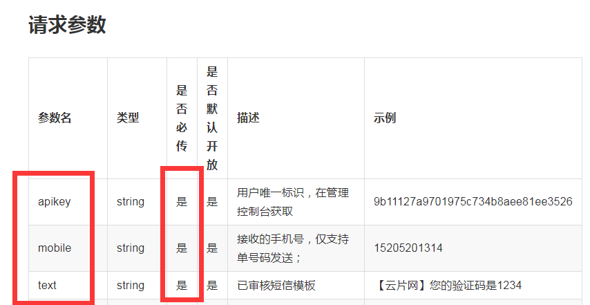
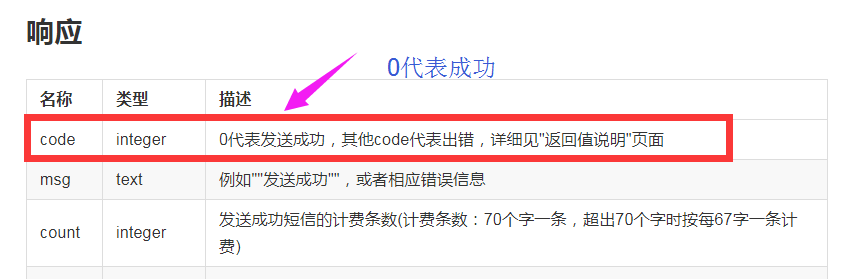
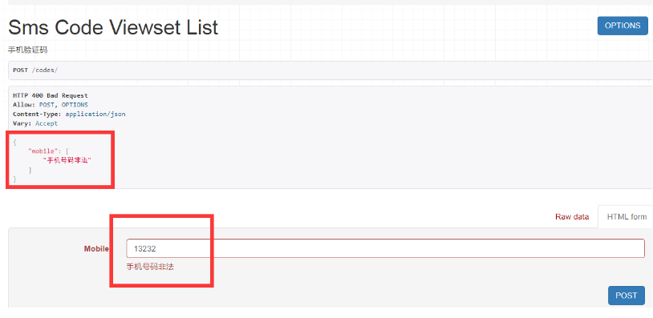
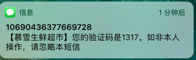
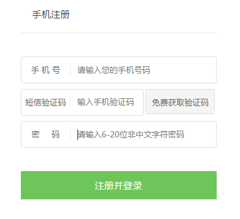

## 用户登录与手机注册

### 1.drf的token

（1）INSTALL_APP中添加

```
INSTALLED_APPS = (
    ...
    'rest_framework.authtoken'
)
```

 token会生成一张表authtoken_token，所以要运行migrations和migrate

（2）url配置  

```
from rest_framework.authtoken import views


urlpatterns = [
    # token
    path('api-token-auth/', views.obtain_auth_token)
]
```

 2.json web token方式完成用户认证

使用方法：http://getblimp.github.io/django-rest-framework-jwt/

（1）安装

```
pip install djangorestframework-jwt
```

（2）使用

```
REST_FRAMEWORK = {
    'DEFAULT_AUTHENTICATION_CLASSES': (
        'rest_framework.authentication.BasicAuthentication',
        'rest_framework.authentication.SessionAuthentication',
        'rest_framework_jwt.authentication.JSONWebTokenAuthentication',
    )
}
```

（3）url

```
 # jwt的token认证接口
    path('jwt-auth/', obtain_jwt_token )
```

### 3.vue和jwt接口调试

vue中登录接口是login

```
//登录
export const login = params => {
  return axios.post(`${local_host}/login/`, params)
}
```

后台的接口跟前端要一致

```
urlpatterns = [
    # jwt的认证接口
    path('login/', obtain_jwt_token )
]
```

现在就可以登录了

 **自定义用户认证**

 （1）settings中配置

```
AUTHENTICATION_BACKENDS = (
    'users.views.CustomBackend',

)
```

（2）users/views.py

[](javascript:void(0);)

```
# users.views.py

from django.contrib.auth.backends import ModelBackend
from django.contrib.auth import get_user_model
from django.db.models import Q

User = get_user_model()

class CustomBackend(ModelBackend):
    """
    自定义用户验证
    """
    def authenticate(self, username=None, password=None, **kwargs):
        try:
            #用户名和手机都能登录
            user = User.objects.get(
                Q(username=username) | Q(mobile=username))
            if user.check_password(password):
                return user
        except Exception as e:
            return None
```

[](javascript:void(0);)

（3）JWT有效时间设置

settings中配置

[](javascript:void(0);)

```
import datetime
#有效期限
JWT_AUTH = {
    'JWT_EXPIRATION_DELTA': datetime.timedelta(days=7),    #也可以设置seconds=20
    'JWT_AUTH_HEADER_PREFIX': 'JWT',                       #JWT跟前端保持一致，比如“token”这里设置成JWT
}
```

[](javascript:void(0);)

 

### 4.云片网发送短信验证码

（1）注册

 “开发认证”-->>“签名管理”-->>“模板管理”

 还要添加iP白名单，测试就用本地ip，部署的时候一定要换成服务器的ip

（2）发送验证码

apps下新建utils文件夹。再新建yunpian.py，代码如下：

[](javascript:void(0);)

```
# apps/utils/yunpian.py

import requests
import json

class YunPian(object):

    def __init__(self, api_key):
        self.api_key = api_key
        self.single_send_url = "https://sms.yunpian.com/v2/sms/single_send.json"

    def send_sms(self, code, mobile):
        #需要传递的参数
        parmas = {
            "apikey": self.api_key,
            "mobile": mobile,
            "text": "【慕雪生鲜超市】您的验证码是{code}。如非本人操作，请忽略本短信".format(code=code)
        }

        response = requests.post(self.single_send_url, data=parmas)
        re_dict = json.loads(response.text)
        return re_dict

if __name__ == "__main__":
    #例如：9b11127a9701975c734b8aee81ee3526
    yun_pian = YunPian("2e87d1xxxxxx7d4bxxxx1608f7c6da23exxxxx2")
    yun_pian.send_sms("2018", "手机号码")
```

[](javascript:void(0);)

### 5.drf实现发送短信验证码接口

手机号验证：

- 是否合法
- 是否已经注册

（1）settings.py

```
# 手机号码正则表达式
REGEX_MOBILE = "^1[358]\d{9}$|^147\d{8}$|^176\d{8}$"
```

（2）users下新建serializers.py,代码如下：

[](javascript:void(0);)

```
# users/serializers.py

import re
from datetime import datetime, timedelta
from MxShop.settings import REGEX_MOBILE
from users.models import VerifyCode
from rest_framework import serializers
from django.contrib.auth import get_user_model
User = get_user_model()


class SmsSerializer(serializers.Serializer):
    mobile = serializers.CharField(max_length=11)
    
    #函数名必须：validate + 验证字段名
    def validate_mobile(self, mobile):
        """
        手机号码验证
        """
        # 是否已经注册
        if User.objects.filter(mobile=mobile).count():
            raise serializers.ValidationError("用户已经存在")

        # 是否合法
        if not re.match(REGEX_MOBILE, mobile):
            raise serializers.ValidationError("手机号码非法")

        # 验证码发送频率
        #60s内只能发送一次
        one_mintes_ago = datetime.now() - timedelta(hours=0, minutes=1, seconds=0)
        if VerifyCode.objects.filter(add_time__gt=one_mintes_ago, mobile=mobile).count():
            raise serializers.ValidationError("距离上一次发送未超过60s")

        return mobile
```

[](javascript:void(0);)

 

（3）APIKEY加到settings里面

```
#云片网APIKEY
APIKEY = "xxxxx327d4be01608xxxxxxxxxx"
```

（4）views后台逻辑

我们要重写CreateModelMixin的create方法，下面是源码：

[](javascript:void(0);)

```
class CreateModelMixin(object):
    """
    Create a model instance.
    """
    def create(self, request, *args, **kwargs):
        serializer = self.get_serializer(data=request.data)
        serializer.is_valid(raise_exception=True)
        self.perform_create(serializer)
        headers = self.get_success_headers(serializer.data)
        return Response(serializer.data, status=status.HTTP_201_CREATED, headers=headers)

    def perform_create(self, serializer):
        serializer.save()

    def get_success_headers(self, data):
        try:
            return {'Location': str(data[api_settings.URL_FIELD_NAME])}
        except (TypeError, KeyError):
            return {}
```

[](javascript:void(0);)

需要加上自己的逻辑

users/views.py

[](javascript:void(0);)

```
from rest_framework.mixins import CreateModelMixin
from rest_framework import viewsets
from .serializers import SmsSerializer
from rest_framework.response import Response
from rest_framework import status
from utils.yunpian import YunPian
from MxShop.settings import APIKEY
from random import choice
from .models import VerifyCode


class SmsCodeViewset(CreateModelMixin,viewsets.GenericViewSet):
    '''
    手机验证码
    '''
    serializer_class = SmsSerializer

    def generate_code(self):
        """
        生成四位数字的验证码
        """
        seeds = "1234567890"
        random_str = []
        for i in range(4):
            random_str.append(choice(seeds))

        return "".join(random_str)

    def create(self, request, *args, **kwargs):
        serializer = self.get_serializer(data=request.data)
        #验证合法
        serializer.is_valid(raise_exception=True)

        mobile = serializer.validated_data["mobile"]

        yun_pian = YunPian(APIKEY)
        #生成验证码
        code = self.generate_code()

        sms_status = yun_pian.send_sms(code=code, mobile=mobile)

        if sms_status["code"] != 0:
            return Response({
                "mobile": sms_status["msg"]
            }, status=status.HTTP_400_BAD_REQUEST)
        else:
            code_record = VerifyCode(code=code, mobile=mobile)
            code_record.save()
            return Response({
                "mobile": mobile
            }, status=status.HTTP_201_CREATED)
```

[](javascript:void(0);)

 

**云片网单条短信发送的使用说明：**



 

 

 

 （5）配置url

```
from users.views import SmsCodeViewset

# 配置codes的url
router.register(r'code', SmsCodeViewset, base_name="code")
```

 

 **开始验证**

 输入不合法的手机号



 

**输入合法的手机号**

 会返回输入的手机号码，并受到短信验证码



 

### **6.user serializer 和validator验证**

**完成注册的接口**



用户注册需要填写手机号，验证码和密码，相当于create model操作，所以继承CreateModelMixin

（1）修改UserProfile中mobile字段

```
mobile = models.CharField("电话",max_length=11,null=True, blank=True)
```

设置允许为空，因为前端只有一个值，是username，所以mobile可以为空

（2）users/serializers.py

代码里面我都写好了注释，就不再重复解释了

```
class UserRegSerializer(serializers.ModelSerializer):
    '''
    用户注册
    '''
    #UserProfile中没有code字段，这里需要自定义一个code序列化字段
    code = serializers.CharField(required=True, write_only=True, max_length=4, min_length=4,
                                 error_messages={
                                        "blank": "请输入验证码",
                                        "required": "请输入验证码",
                                        "max_length": "验证码格式错误",
                                        "min_length": "验证码格式错误"
                                 },
                                help_text="验证码")
    #验证用户名是否存在
    username = serializers.CharField(label="用户名", help_text="用户名", required=True, allow_blank=False,
                                     validators=[UniqueValidator(queryset=User.objects.all(), message="用户已经存在")])

    #验证code
    def validate_code(self, code):
        # 用户注册，已post方式提交注册信息，post的数据都保存在initial_data里面
        #username就是用户注册的手机号，验证码按添加时间倒序排序，为了后面验证过期，错误等
        verify_records = VerifyCode.objects.filter(mobile=self.initial_data["username"]).order_by("-add_time")

        if verify_records:
            # 最近的一个验证码
            last_record = verify_records[0]
            # 有效期为五分钟。
            five_mintes_ago = datetime.now() - timedelta(hours=0, minutes=5, seconds=0)
            if five_mintes_ago > last_record.add_time:
                raise serializers.ValidationError("验证码过期")

            if last_record.code != code:
                raise serializers.ValidationError("验证码错误")

        else:
            raise serializers.ValidationError("验证码错误")

        # 所有字段。attrs是字段验证合法之后返回的总的dict
    def validate(self, attrs):
        #前端没有传mobile值到后端，这里添加进来
        attrs["mobile"] = attrs["username"]
        #code是自己添加得，数据库中并没有这个字段，验证完就删除掉
        del attrs["code"]
        return attrs

    class Meta:
        model = User
        fields = ('username','code','mobile')
```

 

（3）users/views.py

```
class UserViewset(CreateModelMixin,viewsets.GenericViewSet):
    '''
    用户
    '''
    serializer_class = UserRegSerializer
```

 （4）配置url

```
router.register(r'users', UserViewset, base_name="users")
```

**测试代码：**

- 输入已经存在的用户名
- 不输入验证码

### **7.django信号量实现用户密码修改**

（1）完善用户注册

添加一条用户短信验证码数据之后进行验证。

user/views.py

```
class UserViewset(CreateModelMixin,viewsets.GenericViewSet):
    '''
    用户
    '''
    serializer_class = UserRegSerializer
    queryset = User.objects.all()
```

user/serializer.py添加

```
 fields = ('username','code','mobile','password')
```

（2）password不能明文显示和加密保存

需要重载Create方法

```
 #输入密码的时候不显示明文
    password = serializers.CharField(
        style={'input_type': 'password'},label=True,write_only=True
    )

    #密码加密保存
    def create(self, validated_data):
        user = super(UserRegSerializer, self).create(validated_data=validated_data)
        user.set_password(validated_data["password"])
        user.save()
        return user
```

这是重载Create方法，下面介绍如何用信号量来实现

**信号量**

（1）users下面创建signals.py

```
# users/signals.py

from django.db.models.signals import post_save
from django.dispatch import receiver
from rest_framework.authtoken.models import Token

from django.contrib.auth import get_user_model
User = get_user_model()


# post_save:接收信号的方式
#sender: 接收信号的model
@receiver(post_save, sender=User)
def create_user(sender, instance=None, created=False, **kwargs):
    # 是否新建，因为update的时候也会进行post_save
    if created:
        password = instance.password
        #instance相当于user
        instance.set_password(password)
        instance.save()
```

[](javascript:void(0);)

（2）还需要重载配置

users/apps.py

```
# users/apps.py

from django.apps import AppConfig

class UsersConfig(AppConfig):
    name = 'users'
    verbose_name = "用户管理"

    def ready(self):
        import users.signals
```

AppConfig自定义的函数，会在django启动时被运行

现在添加用户的时候，密码就会自动加密存储了

### 8.vue和注册功能联调

生成token的两个重要步骤，一是payload，二是encode

users/views.py

```
class UserViewset(CreateModelMixin,viewsets.GenericViewSet):
    '''
    用户
    '''
    serializer_class = UserRegSerializer
    queryset = User.objects.all()

    def create(self, request, *args, **kwargs):
        serializer = self.get_serializer(data=request.data)
        serializer.is_valid(raise_exception=True)
        user = self.perform_create(serializer)
        re_dict = serializer.data
        payload = jwt_payload_handler(user)
        re_dict["token"] = jwt_encode_handler(payload)
        re_dict["name"] = user.name if user.name else user.username

        headers = self.get_success_headers(serializer.data)

        return Response(re_dict, status=status.HTTP_201_CREATED, headers=headers)

    def perform_create(self, serializer):
        return serializer.save()
```

 